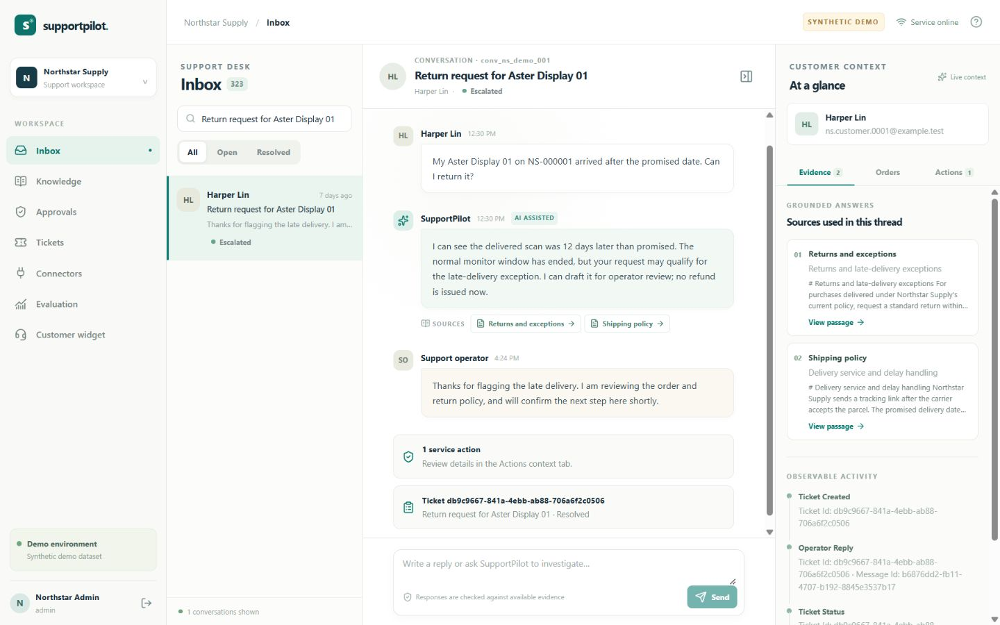

# SupportPilot

> Evidence-backed customer support with reviewable actions.



[Getting started](#getting-started) · [Architecture](docs/ARCHITECTURE.md) · [Evaluation](docs/EVALUATION.md) · [Security](docs/SECURITY.md)

## Overview

SupportPilot is an evidence based support workspace for **Northstar Supply**, a fictional home office retailer. The local **Synthetic demo dataset** lets you upload knowledge, answer customer questions with source passages, inspect an account bound order, propose a return, pause for operator review, and hand unresolved conversations to a ticket. The demo sends no customer messages and makes no model or commerce API calls.

The project is an independent portfolio build. It is a self hosted pilot starting point; [implementation status](docs/IMPLEMENTATION_STATUS.md) records the tested limits and remaining deployment gates.

### Core workflow

**Knowledge upload → cited answer → order context → return review → ticket handoff**

### Capabilities

- Source-linked answers and knowledge versioning
- Order-aware return proposals with human approval
- Workspace-scoped support inbox and ticket handoff

### Technology

FastAPI · React · LangGraph · PostgreSQL/pgvector

### Evidence and scope

23 backend tests passed; 160/160 synthetic evaluation predictions completed. See the evaluation report for denominators and limitations. The included demo uses synthetic data and local simulators. Deployment and live-provider limits are documented in [implementation status](docs/IMPLEMENTATION_STATUS.md).

## Getting started

Run the local demonstration from the repository root using the project-specific instructions below. External service credentials are needed only for connected integrations.

### Run the local DEMO

Prerequisites: Python 3.12, [uv](https://docs.astral.sh/uv/), Node.js 24, and pnpm 11.19.0. Keep ports 8000 and 5173 free. The scripts install the pinned dependencies, create missing synthetic fixtures, seed the local SQLite database on first launch, and start the API and web client. They preserve an existing database unless reset is explicitly requested.

Windows PowerShell:

```powershell
pwsh -File scripts/demo.ps1 -Size full
```

macOS/Linux with Bash:

```bash
cd /path/to/supportpilot
bash scripts/demo.sh full
```

Open [the local console](http://127.0.0.1:5173). [API health](http://127.0.0.1:8000/api/health) reports the selected mode and database. Press Ctrl+C in the launch terminal to stop both services. The full fixture has 120 products, 800 customers, 3,000 orders, 80 knowledge documents, 400 historical conversations, and 40 review proposals across two isolated workspaces. Use `-Size small` or `small` for a faster first look. To intentionally restore the original synthetic state, add `-Reset` or `--reset`; this only replaces the fixture workspaces in DEMO mode. `-PrepareOnly` or `--prepare-only` installs and seeds without starting servers.

All synthetic accounts use `DemoPass!2026`. Sign in as `admin.ns@example.test` to upload and publish knowledge, `ns.customer.0001@example.test` for the example order and customer widget, or `operator.ns@example.test` to review actions and tickets. More IDs and role accounts are in [HANDOVER.md](docs/HANDOVER.md). Never reuse these accounts for customer data.

## Connected installation

The Compose deployment uses PostgreSQL 17 with pgvector, the real model adapter, the same API and web client, and persistent database/upload volumes. It creates an empty customer workspace; it never imports synthetic data automatically.

1. Copy `.env.example` to `.env` at the project root. Set strong, unique `POSTGRES_PASSWORD` and `SECRET_KEY`, plus a bounded spend `OPENAI_API_KEY`. Keep the PostgreSQL password URL safe because Compose includes it in a SQLAlchemy connection URL. Configure the optional Shopify read only order and Zendesk ticket credentials only when needed.
2. Start services with `docker compose up --build -d`. Inspect `docker compose ps` and `docker compose logs api`. Compose applies Alembic migrations and initializes LangGraph PostgreSQL checkpoint tables before the API begins serving.
3. Create the first workspace and administrator interactively, replacing the example values:

```bash
docker compose exec api python scripts/bootstrap_connected.py --workspace "Customer Name" --email "admin@example.com"
```

The command prompts twice for a password of at least 16 characters. Open `http://127.0.0.1:5173` and sign in with the new administrator. There is no dedicated setup form: use an authenticated REST client with that admin session for these workspace-scoped onboarding calls (schemas and responses are at `http://127.0.0.1:8000/docs`):

1. `POST /api/admin/customers` with `{"name":"Pilot Customer","email":"pilot@example.com","password":"a-unique-password-of-16-or-more-characters"}`. Save the returned customer `id`. This creates both the customer record and its login.
2. With `COMMERCE_ADAPTER=local`, `POST /api/admin/products` with `{"sku":"PILOT-001","name":"Pilot Desk","category":"desk","price_cents":29900}`. Save the returned product `id`. Then `POST /api/admin/orders` with the saved `customer_id`, an order `number`, ISO `placed_at`, `status`, `lines` containing that product ID, quantity, and unit price, and `shipments` containing status and applicable ISO delivery dates. [API.md](docs/API.md) has the field details. Customer and product list routes can recover the IDs.
3. With `COMMERCE_ADAPTER=shopify`, create or map the customer identity and configure read-only Shopify credentials; local order creation is disabled. A verified exact-number lookup mirrors a USD order into the local workspace. An unknown SKU enters as `unclassified`: use `PATCH /api/admin/products/{id}` with `{"category":"desk"}` before return eligibility. Orders with over 100 lines or fulfillments fail closed until pagination is implemented.
4. Sign out of the admin session, sign in at `http://127.0.0.1:5173` with the created customer email/password, and open **Customer widget**. Admins and operators can use the same console for knowledge, inbox, approvals, and tickets according to their roles.

For an exposed deployment, put the application behind HTTPS, set `COOKIE_SECURE=true`, restrict origins and network access, and complete the customer specific configuration and validation in [OPERATIONS.md](docs/OPERATIONS.md). Connected mode never silently substitutes a simulated answer after a live model error. Zendesk ticket writes use a reconciliation path at `/api/tickets/{id}/sync` for uncertain outcomes. Live accounts, provider behavior, and PostgreSQL backup/restore still need integration checks.

## Repository guide

| Path | Purpose |
|---|---|
| `apps/api` | FastAPI, SQLAlchemy models, Alembic migrations, LangChain retrieval, LangGraph chat/review workflows, adapters, tests |
| `apps/web` | React/TypeScript support console and customer widget |
| `scripts` | Deterministic fixture generation, local launch, checkpoint setup, connected bootstrap |
| `fixtures` | Small checked in demo and provider failure examples; full data is generated locally |
| `evals` | 160 case evaluation set, runner, machine readable reports, human review sample |
| `docs` | Product, architecture, data, evaluation, security, operations, commercialization, and handover |

For checks, run `uv run ruff check src/supportpilot tests ../../evals/run_demo.py`, `uv run mypy src/supportpilot --follow-imports=silent --ignore-missing-imports`, and `uv run pytest -q` from `apps/api`; run `pnpm check` from `apps/web` for the build and 26 OpenAPI route/method plus document-upload field checks. The latter does not fully validate response types. CI is configured to export the API schema, run `pnpm check`, and verify a fresh SQLite migration. See [EVALUATION.md](docs/EVALUATION.md) for measured results and pending human review.

