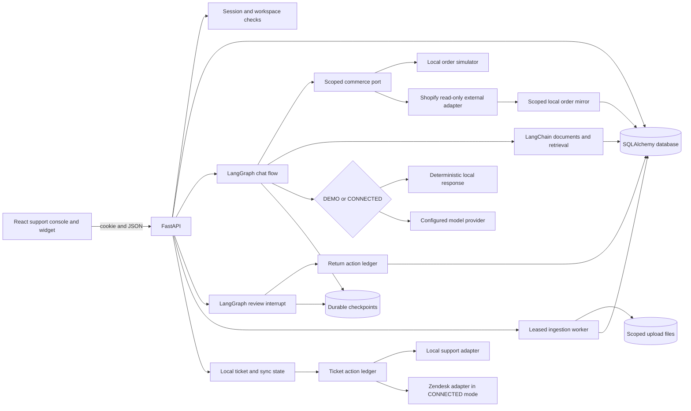
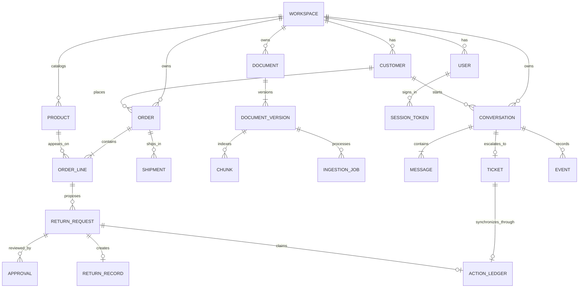

# Architecture

SupportPilot is a Python API and React client sharing one application database. The current local path uses SQLite with WAL and a SQLite LangGraph checkpoint file. SQLAlchemy models and Alembic migrations also include PostgreSQL with pgvector; that deployment path remains unverified in this environment. Large source files live under a workspace-scoped upload directory and are referenced from document versions rather than graph state.

The chat graph currently follows `classify → scoped order lookup → retrieve → evaluate action policy → assess → clarify or compose`. It stores workspace, customer, conversation, message, and optional policy `as_of` references in graph state. A dated policy question can select an ISO date in the prompt; evaluation calls can supply `as_of` explicitly. The review graph pauses for a version-bound human decision and executes the local return after resumption. API handlers recheck role and workspace; the graph thread ID alone does not authorize access. The configured checkpoint saver uses a file next to SQLite or PostgreSQL through `PostgresSaver`. The message SSE route divides an already completed answer into chunks; it does not stream model tokens during graph execution.

Ingestion accepts `.pdf`, `.md`, and `.csv`, checks size and basic type, hashes and stores bytes, extracts page/section text with `pypdf` or text parsers, and chunks with LangChain's `RecursiveCharacterTextSplitter`. Upload may set category and source authority; omitted authority is inferred from filename/category, and a replacement retains the document's existing values. A leased worker processes pending and expired-lease jobs. Manual publication and replacement activate a new effective interval while closing the old one. SQLite retrieval scores term overlap plus a local deterministic 64-dimensional hashed vector; the PostgreSQL branch uses full-text rank plus pgvector cosine distance. Both add a category boost and the workspace's authority priority. Only workspace-scoped, published versions effective for the query date are eligible. A historical published passage remains accessible with its historical flag and effective interval. The full-fixture SQLite retrieval comparison measured 80 grounded questions: acceptable source at rank 1 in 69/80 lexical baseline versus 80/80 local hybrid. PostgreSQL/pgvector retrieval and any reranking decision remain unverified.

## Core relationships

The ERD summarizes logical links. The action ledger links to a proposal through its unique `action_key` and payload rather than a database foreign key. Every relevant table carries a workspace key or reaches one through a parent. The code and migrations are the authoritative schema.

## Failure and state handling

The API saves the customer's message before running the assistant. On model failure it records an `assistant_failed` event and returns a 503 with a retry/escalation message. A review decision includes the proposal version hash; an edit changes that hash, forcing a fresh review. The return ledger and unique proposal-to-return constraint make a repeated local action replayable. An order with multiple shipments must have every shipment delivered before return execution because shipment rows lack line mapping; eligibility then uses the earliest delivery date and disables the late-delivery exception for split orders. The action rechecks eligibility at approval. Escalation stores only conversation-customer orders found through verified lookup events or mentioned order numbers after server-side ownership filtering. It commits the local ticket before support-adapter synchronization. Ticket sync uses a five-minute ledger claim lease and deterministic external ID; the Zendesk adapter searches that ID before creating a ticket. A timeout marks synchronization `uncertain` and requires reconciliation. There is no exactly-once guarantee across arbitrary providers. Ingestion progress and cancellation requests are persisted, and the worker can reclaim an expired lease after restart. See [OPERATIONS.md](OPERATIONS.md) for recovery.
